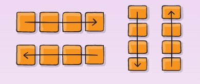
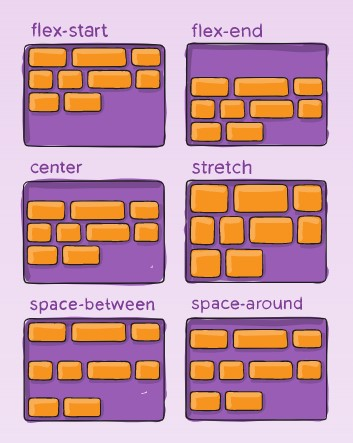
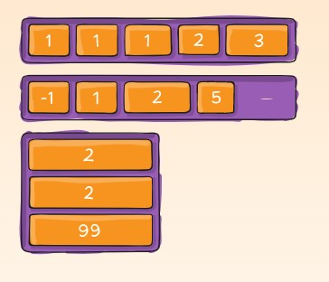
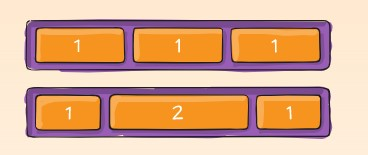

- [FLEXBOX](#flexbox)
  - [BACKGROUND](#background)
  - [BASICS AND TERMINOLOGY](#basics-and-terminology)
  - [FLEXBOX PROPERTIES](#flexbox-properties)
    - [PROPERTIES FOR THE PARENT (FLEX CONTAINER)](#properties-for-the-parent-flex-container)
      - [DISPLAY](#display)
      - [FLEX-DIRECTION](#flex-direction)
      - [FLEX-WRAP](#flex-wrap)
      - [FLEX-FLOW (HP)](#flex-flow-hp)
      - [JUSTIFY-CONTENT](#justify-content)
      - [ALIGN-ITEMS](#align-items)
      - [ALIGN-CONTENT](#align-content)
    - [PROPERTIES FOR THE CHILDREN (FLEX ITEMS)](#properties-for-the-children-flex-items)
      - [ORDER](#order)
      - [FLEX-GROW](#flex-grow)
      - [FLEX-SHRINK](#flex-shrink)
      - [FLEX-BASIS](#flex-basis)
      - [FLEX (HP)](#flex-hp)
      - [ALIGN-SELF](#align-self)
 
# FLEXBOX

Source : https://css-tricks.com/snippets/css/a-guide-to-flexbox

This complete guide explains everything about flexbox, focusing on all the different possible properties for the parent element (the flex container) and the child elements (the flex items). It also includes history, demos, patterns, and a browser support chart.

hp -> helper property

## BACKGROUND

The Flexbox Layout (Flexible Box) module (a W3C Candidate Recommendation as of October 2017) aims at providing a more efficient way to lay out, align and distribute space among items in a container, even when their size is unknown and/or dynamic (thus the word “flex”).

The main idea behind the flex layout is to give the container the ability to alter its items’ width/height (and order) to best fill the available space (mostly to accommodate to all kind of display devices and screen sizes). A flex container expands items to fill available free space or shrinks them to prevent overflow.

Most importantly, the flexbox layout is direction-agnostic as opposed to the regular layouts (block which is vertically-based and inline which is horizontally-based). While those work well for pages, they lack flexibility (no pun intended) to support large or complex applications (especially when it comes to orientation changing, resizing, stretching, shrinking, etc.).

Note: Flexbox layout is most appropriate to the components of an application, and *small-scale layouts*, while the Grid layout is intended for *larger scale layouts*.

## BASICS AND TERMINOLOGY

Since flexbox is a whole module and not a single property, it involves a lot of things including its whole set of properties. Some of them are meant to be set on the container (parent element, known as “flex container”) whereas the others are meant to be set on the children (said “flex items”).

If “regular” layout is based on both block and inline flow directions, the flex layout is based on “flex-flow directions”. Please have a look at this figure from the specification, explaining the main idea behind the flex layout.


main axis – The main axis of a flex container is the primary axis along which flex items are laid out. Beware, it is not necessarily horizontal; it depends on the flex-direction property (see below).

(tr:ana kesen ve karşıt eksen diyebiliriz:)

- main-start | main-end – The flex items are placed within the container starting from main-start and going to main-end.

- main size – A flex item’s width or height, whichever is in the main dimension, is the item’s main size. The flex item’s main size property is either the ‘width’ or ‘height’ property, whichever is in the main dimension.

- cross axis – The axis perpendicular to the main axis is called the cross axis. Its direction depends on the main axis direction.

- cross-start | cross-end – Flex lines are filled with items and placed into the container starting on the cross-start side of the flex container and going toward the cross-end side.

- cross size – The width or height of a flex item, whichever is in the cross dimension, is the item’s cross size. The cross size property is whichever of ‘width’ or ‘height’ that is in the cross dimension.

## FLEXBOX PROPERTIES

### PROPERTIES FOR THE PARENT (FLEX CONTAINER)

#### DISPLAY
  
This defines a flex container; inline or block depending on the given value. It enables a flex context for all its direct children.

```css
.container {
  display: flex; /* or inline-flex */
}
```

Note that CSS columns have no effect on a flex container. (??) 

---

#### FLEX-DIRECTION

This establishes the main-axis, thus defining the direction flex items are placed in the flex container. Flexbox is (aside from optional wrapping) a single-direction layout concept. Think of flex items as primarily laying out either in horizontal rows or vertical columns.



(tr:ana ekseni tanımlar, satır olunca yatay, sütun olunca dikey. Tek yönlü yerleşim kavramı... Flex elemanlarını, tek sütun yatay satırlar veya tek satır dikey sütunlar olarak düşünün (nowrap).:)

```css
.container {
  flex-direction: row | row-reverse | column | column-reverse;
}
```

- row (default): left to right in ltr; right to left in rtl
- row-reverse: right to left in ltr; left to right in rtl
- column: same as row but top to bottom
- column-reverse: same as row-reverse but bottom to top

---

#### FLEX-WRAP


By default, flex items will all try to fit onto one line. You can change that and allow the items to wrap as needed with this property.

```css
.container {
  flex-wrap: nowrap | wrap | wrap-reverse;
}
```

- nowrap (default): all flex items will be on one line
- wrap: flex items will wrap onto multiple lines, from top to bottom.
- wrap-reverse: flex items will wrap onto multiple lines from bottom to top.

There are some visual demos of flex-wrap here : 
https://css-tricks.com/almanac/properties/f/flex-wrap/

---

#### FLEX-FLOW (HP)

This is a shorthand for the flex-direction and flex-wrap properties, which together define the flex container’s main and cross axes. The default value is row nowrap.

```css
.container {
  flex-flow: column wrap;
}
```

---
#### JUSTIFY-CONTENT


This defines the alignment along the main axis. It helps distribute extra free space leftover when either all the flex items on a line are inflexible, or are flexible but have reached their maximum size. It also exerts some control over the alignment of items when they overflow the line. Justifying on main axis...

(tr:ana eksende nasıl yaslanacağını belirler. :)

```css
.container {
  justify-content: flex-start | flex-end | center | space-between | space-around | space-evenly | start | end | left | right ... + safe | unsafe;
}
```

- flex-start (default): items are packed toward the start of the flex-direction.
- flex-end: items are packed toward the end of the flex-direction.
- start: items are packed toward the start of the writing-mode direction.
- end: items are packed toward the end of the writing-mode direction.
- left: items are packed toward left edge of the container, unless that doesn’t make sense with the flex-direction, then it behaves like start.
- right: items are packed toward right edge of the container, unless that doesn’t make sense with the flex-direction, then it behaves like end.

- center: items are centered along the line

- space-between: items are evenly distributed in the line; first item is on the start line, last item on the end line

- space-around: items are evenly distributed in the line with equal space around them. Note that visually the spaces aren’t equal, since all the items have equal space on both sides. The first item will have one unit of space against the container edge, but two units of space between the next item because that next item has its own spacing that applies.

- space-evenly: items are distributed so that the spacing between any two items (and the space to the edges) is equal.

Note that that browser support for these values is nuanced. For example, space-between never got support from some versions of Edge, and start/end/left/right aren’t in Chrome yet. MDN has detailed charts. (https://developer.mozilla.org/en-US/docs/Web/CSS/justify-content) The safest values are flex-start, flex-end, and center.

(??) 
There are also two additional keywords you can pair with these values: safe and unsafe. Using safe ensures that however you do this type of positioning, you can’t push an element such that it renders off-screen (e.g. off the top) in such a way the content can’t be scrolled too (called “data loss”). 

#### ALIGN-ITEMS


This defines the default behavior for how flex items are laid out along **the cross axis** on the current line. Think of it as the justify-content version for the cross-axis (perpendicular to the main-axis). Aligning on the cross axis. 

(tr:cross axis - flex parçaları karşıt eksende hizalama :)

```css
.container {
  align-items: stretch | flex-start | flex-end | center | baseline | first baseline | last baseline | start | end | self-start | self-end + ... safe | unsafe;
}

```
**align-item values**

- stretch (default): stretch to fill the container (still respect min-width/max-width)
- flex-start / start / self-start: items are placed at the start of the cross axis. The difference between these is subtle, and is about respecting the flex-direction rules or the writing-mode rules.
- flex-end / end / self-end: items are placed at the end of the cross axis. The difference again is subtle and is about respecting - flex-direction rules vs. writing-mode rules.
- center: items are centered in the cross-axis
baseline: items are aligned such as their baselines align

The safe and unsafe modifier keywords can be used in conjunction with all the rest of these keywords (although note browser support), and deal with helping you prevent aligning elements such that the content becomes inaccessible.

---

#### ALIGN-CONTENT



This aligns a flex container’s lines within when there is extra space in the cross-axis, similar to how justify-content aligns individual items within the main-axis.

Note: This property only takes effect on multi-line flexible containers (!!!), where flex-flow is set to either *wrap* or *wrap-reverse*). A single-line flexible container (i.e. where flex-flow is set to its default value, no-wrap) will not reflect align-content !!!.

```css
.container {
  align-content: flex-start | flex-end | center | space-between | space-around | space-evenly | stretch | start | end | baseline | first baseline | last baseline + ... safe | unsafe;
}

```
- normal (default): items are packed in their default position as if no value was set.
- flex-start / start: items packed to the start of the container. The (more supported) flex-start honors the flex-direction while start honors the writing-mode direction.
- flex-end / end: items packed to the end of the container. The (more support) flex-end honors the flex-direction while end honors the writing-mode direction.
- center: items centered in the container
- space-between: items evenly distributed; the first line is at the start of the container while the last one is at the end
- space-around: items evenly distributed with equal space around each line
- space-evenly: items are evenly distributed with equal space around them
- stretch: lines stretch to take up the remaining space

The safe and unsafe modifier keywords can be used in conjunction with all the rest of these keywords (although note browser support), and deal with helping you prevent aligning elements such that the content becomes inaccessible.

### PROPERTIES FOR THE CHILDREN (FLEX ITEMS) 

#### ORDER



By default, flex items are laid out in the source order. However, the order property controls the order in which they appear in the flex container.

```css
.item {
  order: 5; /* default is 0 */
}
```

#### FLEX-GROW



This defines the ability for a flex item to grow if necessary. It accepts a unitless value that serves as a proportion. It dictates what amount of the available space inside the flex container the item should take up.

If all items have flex-grow set to 1, the remaining space in the container will be distributed equally to all children. If one of the children has a value of 2, the remaining space would take up twice as much space as the others (or it will try to, at least).

```css
.item {
  flex-grow: 4; /* default 0 */
}
```

Negative numbers are invalid.

#### FLEX-SHRINK

This defines the ability for a flex item to shrink if necessary.

```css
.item {
  flex-shrink: 3; /* default 1 */
}

```

Negative numbers are invalid.

---
#### FLEX-BASIS

This defines the default size of an element before the remaining space is distributed. It can be a length (e.g. 20%, 5rem, etc.) or a keyword. The auto keyword means “look at my width or height property” (which was temporarily done by the main-size keyword until deprecated). The content keyword means “size it based on the item’s content” – this keyword isn’t well supported yet, so it’s hard to test and harder to know what its brethren max-content, min-content, and fit-content do.

```css
.item {
  flex-basis:  | auto; /* default auto */
}
```

If set to 0, the extra space around content isn’t factored in. If set to auto, the extra space is distributed based on its flex-grow value. See this graphic.

---
#### FLEX (HP)

This is the shorthand for flex-grow, flex-shrink and flex-basis combined. The second and third parameters (flex-shrink and flex-basis) are optional. The default is 0 1 auto, but if you set it with a single number value, it’s like 1 0.

```css
.item {
  flex: none | [ <'flex-grow'> <'flex-shrink'>? || <'flex-basis'> ]
}

```

It is recommended that you use this shorthand property rather than set the individual properties. The shorthand sets the other values intelligently.

#### ALIGN-SELF

This allows the default alignment (or the one specified by align-items) to be overridden for individual flex items.

Please see the align-items explanation to understand the available values.

```css
.item {
  align-self: auto | flex-start | flex-end | center | baseline | stretch;
}

```

Note that float, clear and vertical-align have no effect on a flex item.

