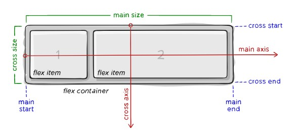
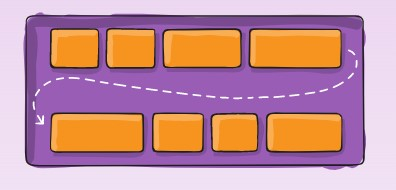
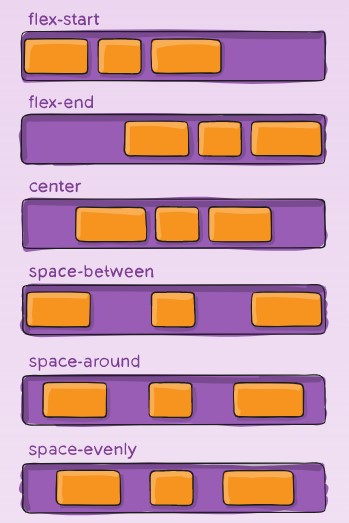
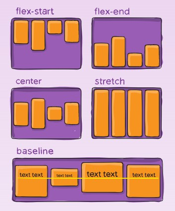

- [Flexbox (Css Tricks)](#flexbox-css-tricks)
  - [Background](#background)
  - [Basics and terminology](#basics-and-terminology)
  - [FLEXBOX PROPERTIES](#flexbox-properties)
    - [PROPERTIES FOR THE PARENT (FLEX CONTAINER)](#properties-for-the-parent-flex-container)
      - [DISPLAY](#display)
      - [FLEX-DIRECTION](#flex-direction)
      - [FLEX-WRAP](#flex-wrap)
      - [FLEX-FLOW (HP)](#flex-flow-hp)
      - [JUSTIFY-CONTENT](#justify-content)
      - [ALIGN-ITEMS](#align-items)
      - [ALIGN-CONTENT](#align-content)
- [Flexbox Container](#flexbox-container)
- [Parent Element (Container)](#parent-element-container)
- [Flexbox Items (w3schools)](#flexbox-items-w3schools)
  - [CSS Flex Items](#css-flex-items)
  - [Flexbox Responsive](#flexbox-responsive)
- [Dive into Flexbox (Bocoup)](#dive-into-flexbox-bocoup)
 
# Flexbox (Css Tricks) 

Source : https://css-tricks.com/snippets/css/a-guide-to-flexbox

This complete guide explains everything about flexbox, focusing on all the different possible properties for the parent element (the flex container) and the child elements (the flex items). It also includes history, demos, patterns, and a browser support chart.

hp -> helper property

## Background

The Flexbox Layout (Flexible Box) module (a W3C Candidate Recommendation as of October 2017) aims at providing a more efficient way to lay out, align and distribute space among items in a container, even when their size is unknown and/or dynamic (thus the word “flex”).

The main idea behind the flex layout is to give the container the ability to alter its items’ width/height (and order) to best fill the available space (mostly to accommodate to all kind of display devices and screen sizes). A flex container expands items to fill available free space or shrinks them to prevent overflow.

Most importantly, the flexbox layout is direction-agnostic as opposed to the regular layouts (block which is vertically-based and inline which is horizontally-based). While those work well for pages, they lack flexibility (no pun intended) to support large or complex applications (especially when it comes to orientation changing, resizing, stretching, shrinking, etc.).

Note: Flexbox layout is most appropriate to the components of an application, and *small-scale layouts*, while the Grid layout is intended for *larger scale layouts*.

## Basics and terminology

Since flexbox is a whole module and not a single property, it involves a lot of things including its whole set of properties. Some of them are meant to be set on the container (parent element, known as “flex container”) whereas the others are meant to be set on the children (said “flex items”).

If “regular” layout is based on both block and inline flow directions, the flex layout is based on “flex-flow directions”. Please have a look at this figure from the specification, explaining the main idea behind the flex layout.



main axis – The main axis of a flex container is the primary axis along which flex items are laid out. Beware, it is not necessarily horizontal; it depends on the flex-direction property (see below).

(tr:ana kesen ve karşıt eksen diyebiliriz:)

- main-start | main-end – The flex items are placed within the container starting from main-start and going to main-end.

- main size – A flex item’s width or height, whichever is in the main dimension, is the item’s main size. The flex item’s main size property is either the ‘width’ or ‘height’ property, whichever is in the main dimension.

- cross axis – The axis perpendicular to the main axis is called the cross axis. Its direction depends on the main axis direction.

- cross-start | cross-end – Flex lines are filled with items and placed into the container starting on the cross-start side of the flex container and going toward the cross-end side.

- cross size – The width or height of a flex item, whichever is in the cross dimension, is the item’s cross size. The cross size property is whichever of ‘width’ or ‘height’ that is in the cross dimension.

## FLEXBOX PROPERTIES

### PROPERTIES FOR THE PARENT (FLEX CONTAINER)

#### DISPLAY
  
This defines a flex container; inline or block depending on the given value. It enables a flex context for all its direct children.

```css
.container {
  display: flex; /* or inline-flex */
}
```

Note that CSS columns have no effect on a flex container. (??) 

---

#### FLEX-DIRECTION

This establishes the main-axis, thus defining the direction flex items are placed in the flex container. Flexbox is (aside from optional wrapping) a single-direction layout concept. Think of flex items as primarily laying out either in horizontal rows or vertical columns.


(tr:ana ekseni tanımlar, satır olunca yatay, sütun olunca dikey. Tek yönlü yerleşim kavramı... Flex elemanlarını, yatay satırlar veya dikey sütunlar olarak düşün.:)

```css
.container {
  flex-direction: row | row-reverse | column | column-reverse;
}
```

- row (default): left to right in ltr; right to left in rtl
- row-reverse: right to left in ltr; left to right in rtl
column: same as row but top to bottom
- column-reverse: same as row-reverse but bottom to top

---

#### FLEX-WRAP



By default, flex items will all try to fit onto one line. You can change that and allow the items to wrap as needed with this property.

```css
.container {
  flex-wrap: nowrap | wrap | wrap-reverse;
}
```

- nowrap (default): all flex items will be on one line
- wrap: flex items will wrap onto multiple lines, from top to bottom.
- wrap-reverse: flex items will wrap onto multiple lines from bottom to top.

There are some visual demos of flex-wrap here : 
https://css-tricks.com/almanac/properties/f/flex-wrap/

---

#### FLEX-FLOW (HP)

This is a shorthand for the flex-direction and flex-wrap properties, which together define the flex container’s main and cross axes. The default value is row nowrap.

```css
.container {
  flex-flow: column wrap;
}
```

---
#### JUSTIFY-CONTENT



This defines the alignment along the main axis. It helps distribute extra free space leftover when either all the flex items on a line are inflexible, or are flexible but have reached their maximum size. It also exerts some control over the alignment of items when they overflow the line. ( ana eksende hizalamasını yapar. )

```css
.container {
  justify-content: flex-start | flex-end | center | space-between | space-around | space-evenly | start | end | left | right ... + safe | unsafe;
}
```

- flex-start (default): items are packed toward the start of the flex-direction.
- flex-end: items are packed toward the end of the flex-direction.
- start: items are packed toward the start of the writing-mode direction.
- end: items are packed toward the end of the writing-mode direction.
- left: items are packed toward left edge of the container, unless that doesn’t make sense with the flex-direction, then it behaves like start.
- right: items are packed toward right edge of the container, unless that doesn’t make sense with the flex-direction, then it behaves like end.

- center: items are centered along the line

- space-between: items are evenly distributed in the line; first item is on the start line, last item on the end line

- space-around: items are evenly distributed in the line with equal space around them. Note that visually the spaces aren’t equal, since all the items have equal space on both sides. The first item will have one unit of space against the container edge, but two units of space between the next item because that next item has its own spacing that applies.

- space-evenly: items are distributed so that the spacing between any two items (and the space to the edges) is equal.

Note that that browser support for these values is nuanced. For example, space-between never got support from some versions of Edge, and start/end/left/right aren’t in Chrome yet. MDN has detailed charts. (https://developer.mozilla.org/en-US/docs/Web/CSS/justify-content) The safest values are flex-start, flex-end, and center.

(%1%) 
There are also two additional keywords you can pair with these values: safe and unsafe. Using safe ensures that however you do this type of positioning, you can’t push an element such that it renders off-screen (e.g. off the top) in such a way the content can’t be scrolled too (called “data loss”). 

#### ALIGN-ITEMS



This defines the default behavior for how flex items are laid out along the cross axis on the current line. Think of it as the justify-content version for the cross-axis (perpendicular to the main-axis). (cross axis - çapraz eksende (resimde y ekseni) konumu nerede olacak, nasıl yerleştirilecek)

```css
.container {
  align-items: stretch | flex-start | flex-end | center | baseline | first baseline | last baseline | start | end | self-start | self-end + ... safe | unsafe;
}

```
**align-item values**

- stretch (default): stretch to fill the container (still respect min-width/max-width)
- flex-start / start / self-start: items are placed at the start of the cross axis. The difference between these is subtle, and is about respecting the flex-direction rules or the writing-mode rules.
- flex-end / end / self-end: items are placed at the end of the cross axis. The difference again is subtle and is about respecting - flex-direction rules vs. writing-mode rules.
- center: items are centered in the cross-axis
baseline: items are aligned such as their baselines align

The safe and unsafe modifier keywords can be used in conjunction with all the rest of these keywords (although note browser support), and deal with helping you prevent aligning elements such that the content becomes inaccessible.

---

#### ALIGN-CONTENT


This aligns a flex container’s lines within when there is extra space in the cross-axis, similar to how justify-content aligns individual items within the main-axis.

Note: This property only takes effect on multi-line flexible containers (!!!), where flex-flow is set to either wrap or wrap-reverse). A single-line flexible container (i.e. where flex-flow is set to its default value, no-wrap) will not reflect align-content.

.container {
  align-content: flex-start | flex-end | center | space-between | space-around | space-evenly | stretch | start | end | baseline | first baseline | last baseline + ... safe | unsafe;
}

normal (default): items are packed in their default position as if no value was set.
flex-start / start: items packed to the start of the container. The (more supported) flex-start honors the flex-direction while start honors the writing-mode direction.
flex-end / end: items packed to the end of the container. The (more support) flex-end honors the flex-direction while end honors the writing-mode direction.
center: items centered in the container
space-between: items evenly distributed; the first line is at the start of the container while the last one is at the end
space-around: items evenly distributed with equal space around each line
space-evenly: items are evenly distributed with equal space around them
stretch: lines stretch to take up the remaining space
The safe and unsafe modifier keywords can be used in conjunction with all the rest of these keywords (although note browser support), and deal with helping you prevent aligning elements such that the content becomes inaccessible.

 Properties for the Children (flex items) 
order
By default, flex items are laid out in the source order. However, the order property controls the order in which they appear in the flex container.

.item {
  order: 5; /* default is 0 */
}

flex-grow
This defines the ability for a flex item to grow if necessary. It accepts a unitless value that serves as a proportion. It dictates what amount of the available space inside the flex container the item should take up.

If all items have flex-grow set to 1, the remaining space in the container will be distributed equally to all children. If one of the children has a value of 2, the remaining space would take up twice as much space as the others (or it will try to, at least).

.item {
  flex-grow: 4; /* default 0 */
}

Negative numbers are invalid.

flex-shrink
This defines the ability for a flex item to shrink if necessary.

.item {
  flex-shrink: 3; /* default 1 */
}

Negative numbers are invalid.

flex-basis
This defines the default size of an element before the remaining space is distributed. It can be a length (e.g. 20%, 5rem, etc.) or a keyword. The auto keyword means “look at my width or height property” (which was temporarily done by the main-size keyword until deprecated). The content keyword means “size it based on the item’s content” – this keyword isn’t well supported yet, so it’s hard to test and harder to know what its brethren max-content, min-content, and fit-content do.

.item {
  flex-basis:  | auto; /* default auto */
}

If set to 0, the extra space around content isn’t factored in. If set to auto, the extra space is distributed based on its flex-grow value. See this graphic.

flex (sh)
This is the shorthand for flex-grow, flex-shrink and flex-basis combined. The second and third parameters (flex-shrink and flex-basis) are optional. The default is 0 1 auto, but if you set it with a single number value, it’s like 1 0.

.item {
  flex: none | [ <'flex-grow'> <'flex-shrink'>? || <'flex-basis'> ]
}

It is recommended that you use this shorthand property rather than set the individual properties. The shorthand sets the other values intelligently.

align-self
This allows the default alignment (or the one specified by align-items) to be overridden for individual flex items.

Please see the align-items explanation to understand the available values.

.item {
  align-self: auto | flex-start | flex-end | center | baseline | stretch;
}

Note that float, clear and vertical-align have no effect on a flex item.

# Flexbox Container

CSS Flexbox Layout Module
Before the Flexbox Layout module, there were four layout modes:

Block, for sections in a webpage
Inline, for text
Table, for two-dimensional table data
Positioned, for explicit position of an element

The Flexible Box Layout Module, makes it easier to design flexible responsive layout structure without using float or positioning.

Flexbox Elements
To start using the Flexbox model, you need to first define a flex container.

Example
A flex container with three flex items:

<div class="flex-container">
  <div>1</div>
  <div>2</div>
  <div>3</div>
</div>

# Parent Element (Container)

Parent Element (Container)
Like we specified in the previous chapter, this is a flex container (the blue area) with three flex items:
The flex container becomes flexible by setting the display property to flex:

Example
.flex-container {
  display: flex;
}

The flex container properties are:
flex-direction
flex-wrap
flex-flow
justify-content
align-items
align-content

The flex-direction Property
The flex-direction property defines in which direction the container wants to stack the flex items.

Example
The column value stacks the flex items vertically (from top to bottom): (yukarıdan aşağıya sola bitişik kutular)

.flex-container {
  display: flex;
  flex-direction: column;
}

Example
The column-reverse value stacks the flex items vertically (but from bottom to top):

.flex-container {
  display: flex;
  flex-direction: column-reverse;
}

Example
The row value stacks the flex items horizontally (from left to right):

.flex-container {
  display: flex;
  flex-direction: row;
}

Example
The row-reverse value stacks the flex items horizontally (but from right to left):

.flex-container {
  display: flex;
  flex-direction: row-reverse;
}

The flex-wrap Property
The flex-wrap property specifies whether the flex items should wrap or not.

The examples below have 12 flex items, to better demonstrate the flex-wrap property. (flex-wrap özelliğini aktif etmemiş olsaydık, hepsi yanyana dizilirdi. Ekrana sığmazsa da scroll yapar.)

Example
The wrap value specifies that the flex items will wrap if necessary:

.flex-container {
  display: flex;
  flex-wrap: wrap;
}

Example
The nowrap value specifies that the flex items will not wrap (this is default):

.flex-container {
  display: flex;
  flex-wrap: nowrap;
}

Example
The wrap-reverse value specifies that the flexible items will wrap if necessary, in reverse order: ( normalde bir aşağıda satıra giderken, bu sefer bir yukarı satıra geçer)

.flex-container {
  display: flex;
  flex-wrap: wrap-reverse;
}

The flex-flow Property
The flex-flow property is a shorthand property for setting both the flex-direction and flex-wrap properties.

Example
.flex-container {
  display: flex;
  flex-flow: row wrap;
}

The justify-content Property
The justify-content property is used to align the flex items: (takip ettikleri eksen üzerinde (ana eksen) yaslama yapar, default da x ekseni üzerinde yapar, çünkü kutular x ekseni üzerinde sıralanıyor. flex-flow column ise y ekseni üzerinde yapar)

Example
The center value aligns the flex items at the center of the container:

.flex-container {
  display: flex;
  justify-content: center;
}
Example
The flex-start value aligns the flex items at the beginning of the container (this is default): 

.flex-container {
  display: flex;
  justify-content: flex-start;
}

Example
The flex-end value aligns the flex items at the end of the container:

.flex-container {
  display: flex;
  justify-content: flex-end;
}

Example
The space-around value displays the flex items with space before, between, and after the lines: (her kutunun sagında ve solunda ortalama bir boşluk bırakır, mesela 10px, ilk kutunun sağında ve solunda 10px olur, ikinci kutunun da. birinci kutu ile ikinci kutu arasında 20px boşluk olur.)  [-|--|--|--|-]) 

.flex-container {
  display: flex;
  justify-content: space-around;
}

Example
The space-between value displays the flex items with space between the lines: (örneğin ilk kutu sola gelir, son kutuda sağa gelir. aradaki diger kutular arasında eşit boşluk bırakır. [|--|--|--|])

.flex-container {
  display: flex;
  justify-content: space-between;
}

The align-items Property
The align-items property is used to align the flex items. ( flex kutusunu hizalamak için kullanılır. ters eksen üzerinde. varsayılan flex-flow row olunca , y ekseni üzerinde hizalama yapar )

In these examples we use a 200 pixels high container, to better demonstrate the align-items property.

Example
The center value aligns the flex items in the middle of the container:

.flex-container {
  display: flex;
  height: 200px;
  align-items: center;
}

Example
The flex-start value aligns the flex items at the top of the container:

.flex-container {
  display: flex;
  height: 200px;
  align-items: flex-start;
}
Example
The flex-end value aligns the flex items at the bottom of the container:

.flex-container {
  display: flex;
  height: 200px;
  align-items: flex-end;
}

Example
The stretch value stretches the flex items to fill the container (this is default): (container sonuna kadar doldurur, grow yapar)

.flex-container {
  display: flex;
  height: 200px;
  align-items: stretch;
}
Example
The baseline value aligns the flex items such as their baselines aligns: (kutuların merkez orta noktalarını göre hizalar, ortada olacak şekilde.)

.flex-container {
  display: flex;
  height: 200px;
  align-items: baseline;
}

The align-content Property
The align-content property is used to align the flex lines. (bir kolona (yatay veya dikey) sığmayan flex elemanlarını ayarlamak için kullanılır. )
In these examples we use a 600 pixels high container, with the flex-wrap property set to wrap, to better demonstrate the align-content property.

Example
The space-between value displays the flex lines with equal space between them:

.flex-container {
  display: flex;
  height: 600px;
  flex-wrap: wrap;
  align-content: space-between;
}

Example
The space-around value displays the flex lines with space before, between, and after them:

.flex-container {
  display: flex;
  height: 600px;
  flex-wrap: wrap;
  align-content: space-around;
}
Example
The stretch value stretches the flex lines to take up the remaining space (this is default): (örneğin üç satıra sığacaksa ,üç satırı full bir şekilde kullanılır.)

.flex-container {
  display: flex;
  height: 600px;
  flex-wrap: wrap;
  align-content: stretch;
}
Example
The center value displays display the flex lines in the middle of the container:

.flex-container {
  display: flex;
  height: 600px;
  flex-wrap: wrap;
  align-content: center;
}

Example
The flex-start value displays the flex lines at the start of the container:

.flex-container {
  display: flex;
  height: 600px;
  flex-wrap: wrap;
  align-content: flex-start;
}

Example
The flex-end value displays the flex lines at the end of the container: 

.flex-container {
  display: flex;
  height: 600px;
  flex-wrap: wrap;
  align-content: flex-end;
}

Perfect Centering
In the following example we will solve a very common style problem: perfect centering.

SOLUTION: Set both the justify-content and align-items properties to center, and the flex item will be perfectly centered:

Example
.flex-container {
  display: flex;
  height: 300px;
  justify-content: center;
  align-items: center;
}

# Flexbox Items (w3schools)

## CSS Flex Items

CSS Flex Items

Child Elements (Items)

The direct child elements of a flex container automatically becomes flexible (flex) items. ( flex container'daki her bir element, flex item'dır, yani her kutu bir flex item.)

The element below represents four blue flex items inside a grey flex container.

Example
<div class="flex-container">
  <div>1</div>
  <div>2</div>
  <div>3</div>
  <div>4</div>
</div>

The flex item properties are:

order
flex-grow
flex-shrink
flex-basis
flex
align-self

The order Property
The order property specifies the order of the flex items.

The first flex item in the code does not have to appear as the first item in the layout.

The order value must be a number, default value is 0.

Example
The order property can change the order of the flex items:

<div class="flex-container">
  <div style="order: 3">1</div>
  <div style="order: 2">2</div>
  <div style="order: 4">3</div>
  <div style="order: 1">4</div>
</div>

The flex-grow Property
The flex-grow property specifies how much a flex item will grow relative to the rest of the flex items. (digerlerine nazaran nasıl büyüyecek.)

The value must be a number, default value is 0.

Example
Make the third flex item grow eight times faster than the other flex items: ( flex itemlar 1x,1x,8x olarak container içindeki alanı paylaşırlar)

<div class="flex-container">
  <div style="flex-grow: 1">1</div>
  <div style="flex-grow: 1">2</div>
  <div style="flex-grow: 8">3</div>
</div>

The flex-shrink Property
The flex-shrink property specifies how much a flex item will shrink relative to the rest of the flex items. (digerlerine nazaran nasıl daha küçüyeceğini belirtir.)

The value must be a number, default value is 1.

Example
Do not let the third flex item shrink as much as the other flex items:

<div class="flex-container">
  <div>1</div>
  <div>2</div>
  <div style="flex-shrink: 0">3</div>
  <div>4</div>
  <div>5</div>
  <div>6</div>
  <div>7</div>
  <div>8</div>
  <div>9</div>
  <div>10</div>
</div>

The flex-basis Property
The flex-basis property specifies the initial length of a flex item.

Example
Set the initial length of the third flex item to 200 pixels:

<div class="flex-container">
  <div>1</div>
  <div>2</div>
  <div style="flex-basis: 200px">3</div>
  <div>4</div>
</div>

The flex Property
The flex property is a shorthand property for the flex-grow, flex-shrink, and flex-basis properties.

Example
Make the third flex item not growable (0), not shrinkable (0), and with an initial length of 200 pixels:

<div class="flex-container">
  <div>1</div>
  <div>2</div>
  <div style="flex: 0 0 200px">3</div>
  <div>4</div>
</div>

The align-self Property
The align-self property specifies the alignment for the selected item inside the flexible container.

The align-self property overrides the default alignment set by the container's align-items property.

In these examples we use a 200 pixels high container, to better demonstrate the align-self property:

Example
Align the third flex item in the middle of the container:

<div class="flex-container">
  <div>1</div>
  <div>2</div>
  <div style="align-self: center">3</div>
  <div>4</div>
</div>
.flex-container { display: flex; height: 200px; background-color: #f1f1f1; } .flex-container > div { 
background-color: DodgerBlue; 
color: white; width: 100px; 
margin: 10px; 
text-align: center; 
line-height: 75px; 
font-size: 30px; 
}


Example
Align the second flex item at the top of the container, and the third flex item at the bottom of the container:

<div class="flex-container">
  <div>1</div>
  <div style="align-self: flex-start">2</div>
  <div style="align-self: flex-end">3</div>
  <div>4</div>
</div>

## Flexbox Responsive

https://www.w3schools.com/css/css3_flexbox_responsive.asp

# Dive into Flexbox (Bocoup)

https://bocoup.com/blog/dive-into-flexbox

